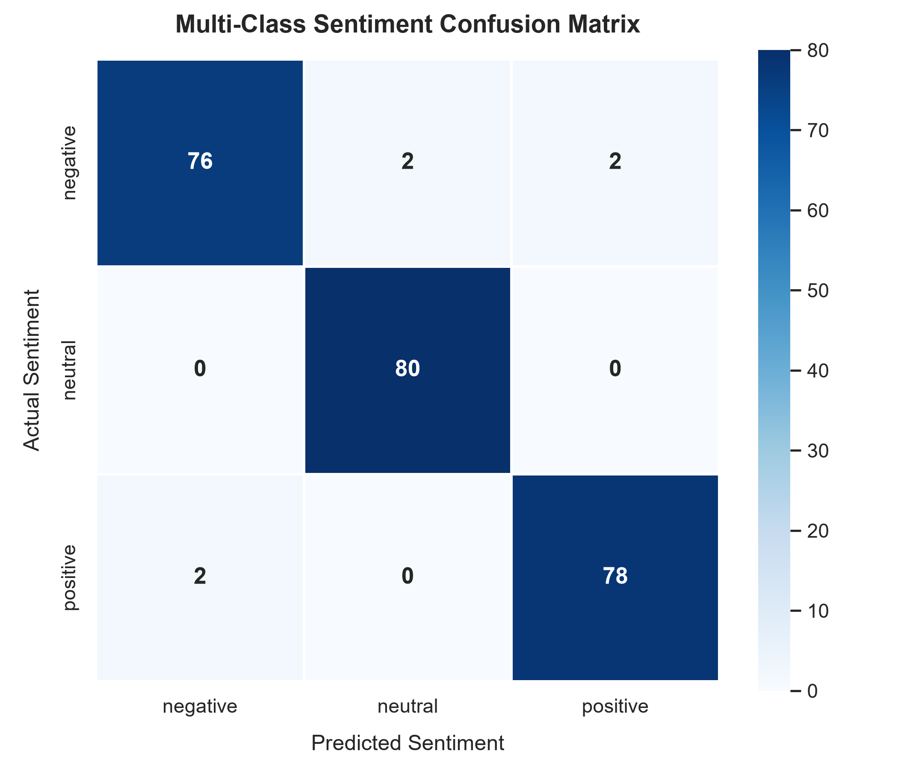

# Progree Artificial Intelligence Remote Internship

[](https://www.python.org/)
[](https://scikit-learn.org/)
[](https://www.nltk.org/)
[]()

Repository containing solutions, code pipelines, and technical reports for the **Progree Artificial Intelligence Remote Internship Program**.

---

## 📌 Internship Progress Dashboard

| Task # | Task Title | Domain | Status | Deliverables |
| :---: | :--- | :--- | :---: | :--- |
| **Task 1** | **Professional LinkedIn Announcement** | Social / Professional | ⏳ *Pending Offer Letter* | Post Copy, Graphic, Goal Statement |
| **Task 2** | **Intelligent Multi-Class Natural Language Text Sentiment Classifier** | NLP & Machine Learning | ✅ **Completed** | [Code](Task_2_Sentiment_Classifier/), [Report](Task_2_Sentiment_Classifier/REPORT.md), [Heatmap](Task_2_Sentiment_Classifier/artifacts/confusion_matrix.png) |
| **Task 3** | **Heuristic Graph Pathfinding Agent Search Engine** | Heuristic Search & AI | ⏳ *Next Up* | A* / Dijkstra / Q-Learning Maze Agent |
| **Task 4** | **Mini Project - Computer Vision Object Detector & Frame Segmenter** | Computer Vision (OpenCV / YOLO) | ⏳ *Upcoming* | Real-Time Video Pipeline & Whitepaper |

---

## 🚀 Task 2: Intelligent Multi-Class Text Sentiment Classifier

### Overview
An end-to-end Natural Language Processing classification engine categorizing unstructured text statements into **Positive**, **Neutral**, and **Negative** sentiment classes with **97.50% Accuracy** and **0.9749 Macro F1-Score**.

### Key Architectural Highlights
- **Preprocessing**: Surface cleaning, custom negation preservation (`not`, `no`, `never` retained to prevent sentiment inversion), and Part-of-Speech (POS) guided WordNet lemmatization.
- **Feature Extraction**: TF-IDF vectorization with uni-grams and bi-grams (`ngram_range=(1, 2)`) and sublinear term frequency damping.
- **Model Benchmark**: 5-Fold Stratified Cross-Validation across Multinomial Logistic Regression, Linear Support Vector Classifier (LinearSVC), and Multinomial Naive Bayes.
- **Production Classifier**: Multinomial Logistic Regression with balanced class weighting.

### Test Set Performance ($N=240$)
- **Overall Accuracy**: `97.50%`
- **Macro F1-Score**: `0.9749`
- **Weighted F1-Score**: `0.9749`
- **Macro Precision**: `0.9750`
- **Macro Recall**: `0.9750`

### Confusion Matrix
<p align="center">
  
</p>

### Quick Start (Task 2)
```bash
# Navigate to the task directory
cd "Task_2_Sentiment_Classifier"

# Run full training and evaluation pipeline
.\.venv\Scripts\python.exe main.py
# Or simply double-click run.bat

# Launch interactive prediction terminal
.\.venv\Scripts\python.exe main.py --interactive
# Or double-click run_interactive.bat
```

---

## 📂 Repository Structure

```
.
├── Task_2_Sentiment_Classifier/
│   ├── data/
│   │   ├── create_dataset.py        # Balanced multi-domain dataset generator
│   │   └── sentiment_data.csv       # 1,200 labeled samples (positive/neutral/negative)
│   ├── src/
│   │   ├── __init__.py
│   │   ├── preprocess.py            # Negation-aware NLTK cleaning & POS lemmatizer
│   │   ├── features.py              # TF-IDF vectorizer & embedding tradeoff analysis
│   │   ├── train.py                 # Multi-model training, 5-Fold CV & pipeline persistence
│   │   └── evaluate.py              # F1 metrics, classification report & heatmap plotter
│   ├── tests/
│   │   └── test_components.py       # Automated unit tests
│   ├── artifacts/
│   │   ├── confusion_matrix.png     # Heatmap visualization
│   │   └── sentiment_model.joblib   # Trained pipeline artifact
│   ├── main.py                      # Main entrypoint driver
│   ├── run.bat                      # One-click Windows launcher
│   ├── run_interactive.bat          # One-click interactive launcher
│   ├── requirements.txt             # Project dependencies
│   └── REPORT.md                    # Detailed technical whitepaper
├── Reports/                         # Final printable/submitted reports
│   └── Task_02_Sentiment_Classifier_Report.html
├── .gitignore                       # Clean Git configuration
└── README.md                        # Master repository documentation
```

---

## 📜 Reports & Submission
Official task reports required for the final Progree internship evaluation are archived in the [`Reports/`](Reports/) directory and linked inside each respective task folder.
