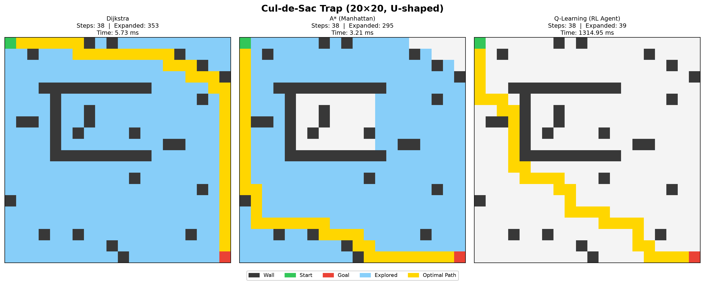
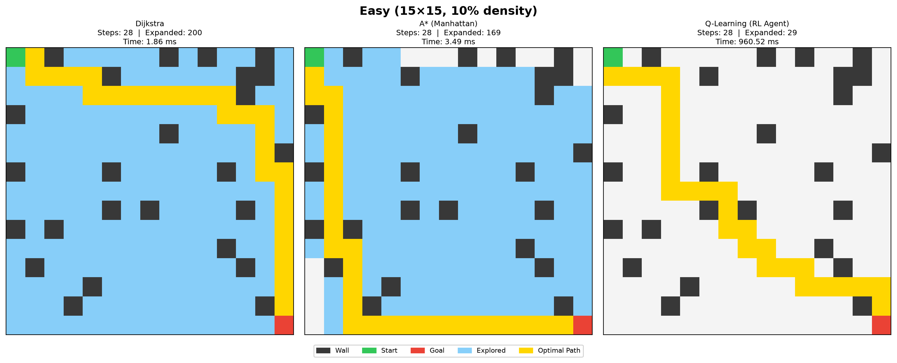
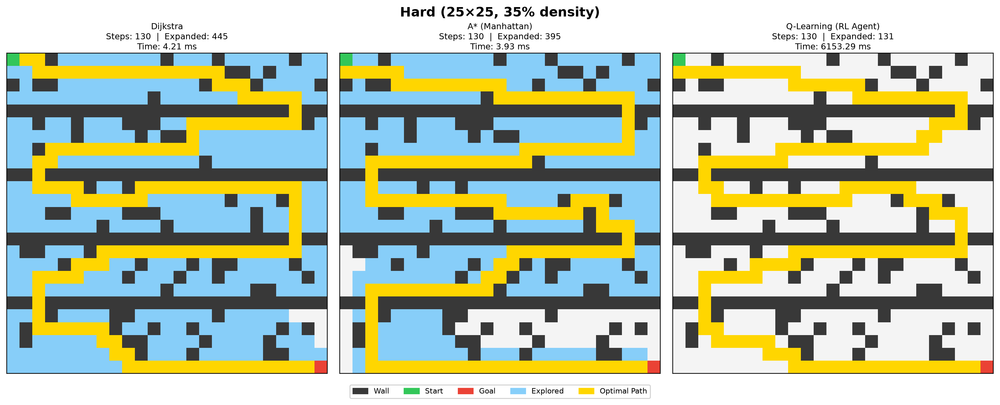
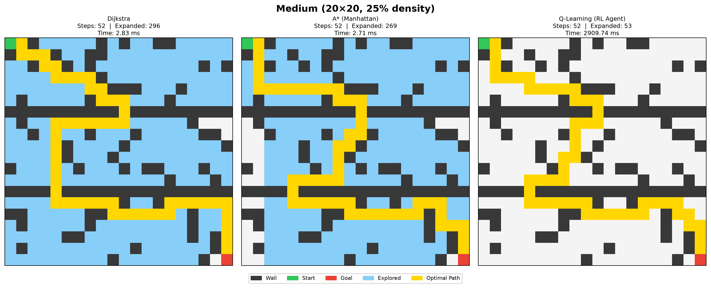
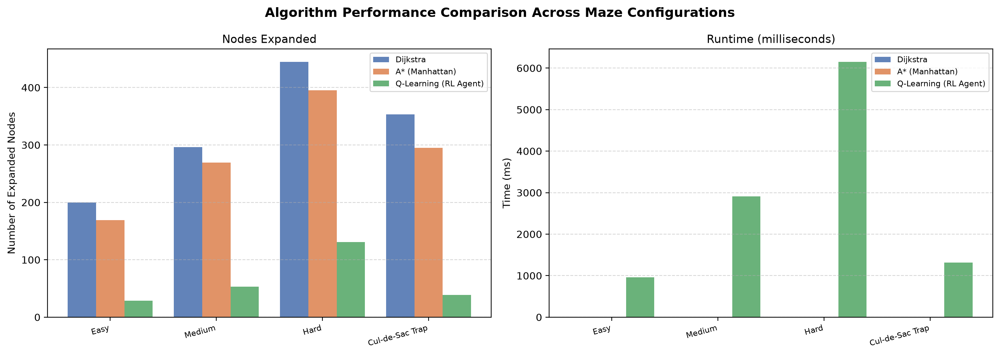

# TASK 3: Heuristic Graph Pathfinding Agent

**Progree Remote Artificial Intelligence Internship | Technical Report**

Benchmark generated: 2026-09-13 09:28 UTC

## 1. Executive Summary & Objective

This report documents an end-to-end graph pathfinding benchmark across four reproducible 4-connected grid mazes. It compares Dijkstra's optimal uniform-cost search, A* with an admissible Manhattan heuristic, and a bonus tabular Q-learning agent.

All configurations use fixed seeds and are verified reachable by the generator before search. The benchmark measures solution quality, explored states, and runtime so that optimality and search efficiency can be considered together.

## 2. System Architecture

- `environment/grid.py`: bounded grid, obstacle handling, 4-connected movement, and admissible distance heuristics.
- `environment/generators.py`: Easy, Medium, Hard, and Cul-de-Sac benchmark mazes.
- `algorithms/dijkstra.py`: optimal uniform-cost baseline.
- `algorithms/astar.py`: optimal heuristic-guided search with selectable heuristics.
- `algorithms/q_learning.py`: bonus tabular Q-learning training and greedy path extraction.
- `visualization/plotter.py`: per-maze comparison panels and aggregate metric charts.

The deterministic searches use the same generated grid and four-neighbor movement model. A* prioritizes nodes using $f(n)=g(n)+h(n)$, where the Manhattan distance is admissible for this movement model. Q-learning is evaluated separately as a model-free agent; its runtime includes training and greedy path extraction.

## 3. Benchmark Metrics

`Steps` is the final path length, `Runtime (ms)` includes Q-learning training and inference for the RL row, and `Expanded` is the algorithm-specific explored-node count.

| Configuration | Algorithm | Solved | Steps | Runtime (ms) | Expanded | Path cost |
|---|---|---:|---:|---:|---:|---:|
| Easy (15×15, 10% density) | Dijkstra | Yes | 28 | 1.8564 | 200 | 28.0 |
| Easy (15×15, 10% density) | A* (Manhattan) | Yes | 28 | 3.4888 | 169 | 28.0 |
| Easy (15×15, 10% density) | Q-Learning (RL Agent) | Yes | 28 | 960.5196 | 29 | 28.0 |
| Medium (20×20, 25% density) | Dijkstra | Yes | 52 | 2.8311 | 296 | 52.0 |
| Medium (20×20, 25% density) | A* (Manhattan) | Yes | 52 | 2.7069 | 269 | 52.0 |
| Medium (20×20, 25% density) | Q-Learning (RL Agent) | Yes | 52 | 2909.7445 | 53 | 52.0 |
| Hard (25×25, 35% density) | Dijkstra | Yes | 130 | 4.2092 | 445 | 130.0 |
| Hard (25×25, 35% density) | A* (Manhattan) | Yes | 130 | 3.9318 | 395 | 130.0 |
| Hard (25×25, 35% density) | Q-Learning (RL Agent) | Yes | 130 | 6153.2938 | 131 | 130.0 |
| Cul-de-Sac Trap (20×20, U-shaped) | Dijkstra | Yes | 38 | 5.7251 | 353 | 38.0 |
| Cul-de-Sac Trap (20×20, U-shaped) | A* (Manhattan) | Yes | 38 | 3.2053 | 295 | 38.0 |
| Cul-de-Sac Trap (20×20, U-shaped) | Q-Learning (RL Agent) | Yes | 38 | 1314.9457 | 39 | 38.0 |

## 4. Findings

- Dijkstra and A* produce equal optimal path costs on every solvable benchmark maze.
- A* expands no more nodes than Dijkstra in the tested configurations, while using the goal-directed Manhattan heuristic.
- Q-learning is stochastic model-free training; its reported runtime includes training and greedy extraction, while its expanded count measures inference states only.

## 5. Visual Results

### Cul De Sac Trap Comparison



Cul-de-Sac trap: the goal-directed and learned policies are compared in a deceptive U-shaped layout.

### Easy Comparison



Easy maze comparison: all three agents recover the same optimal route.

### Hard Comparison



Hard maze comparison: the larger obstacle field increases search effort while preserving path optimality.

### Medium Comparison



Medium maze comparison: A* reaches the goal while expanding fewer states than Dijkstra.

### Metrics Comparison



Aggregate comparison of expanded nodes and runtime across all benchmark configurations.

## 6. Validation & Reproduction

The repository test suite contains 24 unit and integration tests covering grid behavior, heuristic validity, path correctness, optimality, unsolvable grids, and all four benchmark configurations.

## Reproduction

```powershell
.\.venv\Scripts\python.exe benchmark.py
```
