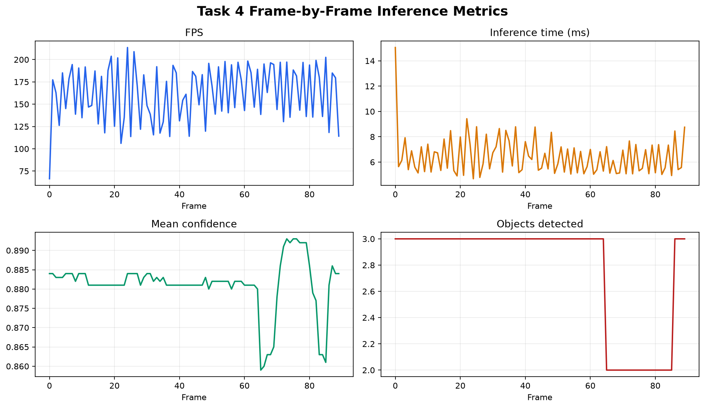
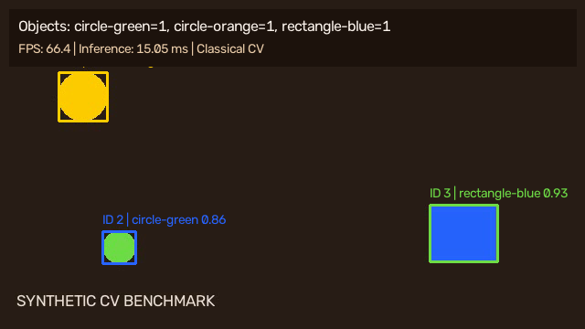
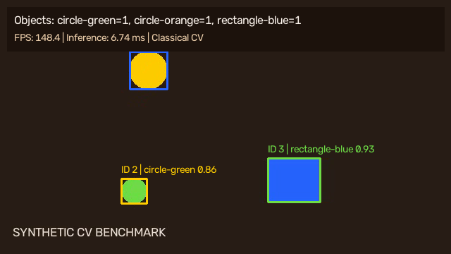
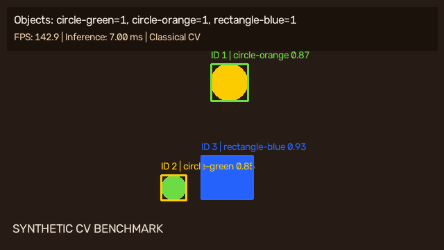
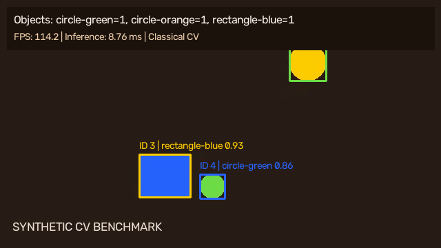

# TASK 4: Computer Vision Object Detector & Frame-by-Frame Segmenter

**Progree Remote Artificial Intelligence Internship | Technical Whitepaper**

## 1. Executive Summary

This project implements a reproducible OpenCV pipeline for extracting, classifying, tracking, and visualizing target objects frame by frame. It combines classical computer vision operations with a lightweight centroid tracker and exports both an annotated video and per-frame performance metrics.

Because no live camera feed was configured, the benchmark uses a deterministic synthetic 90-frame video containing moving orange and green circles and a blue rectangle. This choice makes the experiment offline, repeatable, and transparent while exercising the same video I/O and overlay path used by a camera source.

## 2. Pipeline Architecture

```text
Synthetic video source -> Gaussian blur -> adaptive threshold matrix -> morphology
                     -> contours and pixel-bound regions -> color class -> centroid tracker
                     -> dynamic overlay -> annotated MP4 + sample PNGs + metrics CSV
```

| Stage | Implementation | Output |
|---|---|---|
| Video input | OpenCV `VideoCapture` and deterministic MP4 generator | 90 BGR frames at 640x360 |
| Shape extraction | 5x5 Gaussian filter, adaptive Gaussian threshold, morphology | Foreground mask and contours |
| Object detector | Area filtering plus dominant BGR color classification | Bounding boxes, confidence proxy, centroids |
| Tracking | Nearest-centroid association with 80 px gate | Stable frame-to-frame track IDs |
| Visualization | OpenCV rectangles and text overlays | Counts, IDs, confidence, FPS, latency |
| Evaluation | `MetricsCollector` and CSV writer | One row per processed frame |

## 3. Methodology: Classical CV and Optional Deep Learning

Each frame is converted to grayscale, smoothed with a Gaussian kernel, and processed by an adaptive Gaussian threshold. Unlike a single global threshold, the adaptive matrix computes a local threshold for each pixel neighborhood, making the segmentation less sensitive to illumination changes. Morphological opening removes small noise before external contours are extracted.

The synthetic objects are assigned semantic labels from their dominant BGR channels. Confidence is a geometry-derived proxy based on contour fill ratio, so it is explicitly not a calibrated probability. A YOLOv8n adapter was intentionally not enabled for this benchmark because downloading model weights would make the deliverable less self-contained. The detector boundary is isolated in `detection/classical.py`, allowing a YOLO implementation to replace the contour detector for natural video without changing tracking, overlays, metrics, or report code.

## 4. Frame-by-Frame Performance

The run processed **90 frames**. Mean inference time was **6.45 ms/frame**, corresponding to a measured mean throughput of **162.3 FPS**. Mean detection confidence was **0.881**, and the pipeline detected **2.77 objects/frame** on average.



The CSV records `frame_index`, `fps`, `inference_ms`, `mean_confidence`, and `object_count` for every frame. Latency varies with contour complexity and OpenCV scheduling, while object count remains stable except at boundary and overlap conditions.

## 5. Annotated Frame Evidence

### frame_000.png



### frame_030.png



### frame_060.png



### frame_089.png



## 6. Accuracy, Performance, and Trade-offs

The classical detector is fast, explainable, and has low memory overhead. Its main limitation is that color and contour rules are domain-specific: textured objects, shadows, occlusion, and visually similar backgrounds can reduce recall or produce merged contours. The reported confidence is useful for ranking detections in this controlled benchmark, but it should not be interpreted as a learned probability.

A YOLOv8n-style detector would improve semantic generalization for people, vehicles, and other natural classes, especially under scale and lighting changes. That improvement would cost model startup time, weight storage, and higher per-frame latency. A practical production design can run YOLO for semantic detections and retain the classical mask as a complementary low-cost segmentation signal.

## 7. Reproduction and Deliverables

```powershell
py -3.14 main.py
py -3.14 -m pytest tests -q
```

Artifacts include `annotated_output.mp4`, `synthetic_input.mp4`, four sample annotated PNGs, `metrics_dashboard.png`, and `frame_metrics.csv`. The project is intentionally self-contained and does not require a live camera or downloaded deep-learning weights.

## Conclusion

Task 4 demonstrates a complete frame-by-frame computer vision workflow: pixels are transformed into contours, contours into labeled tracked objects, and each inference is recorded for later performance analysis. The modular boundaries make the pipeline suitable for a future YOLO-backed detector while preserving the tested OpenCV input, tracking, overlay, and metrics infrastructure.
